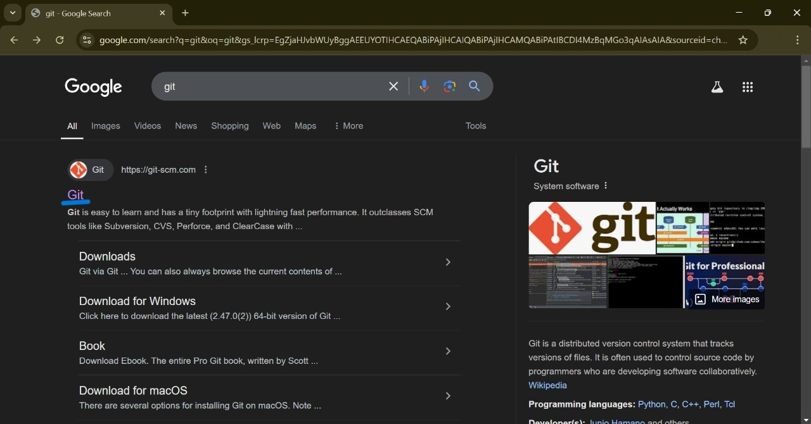
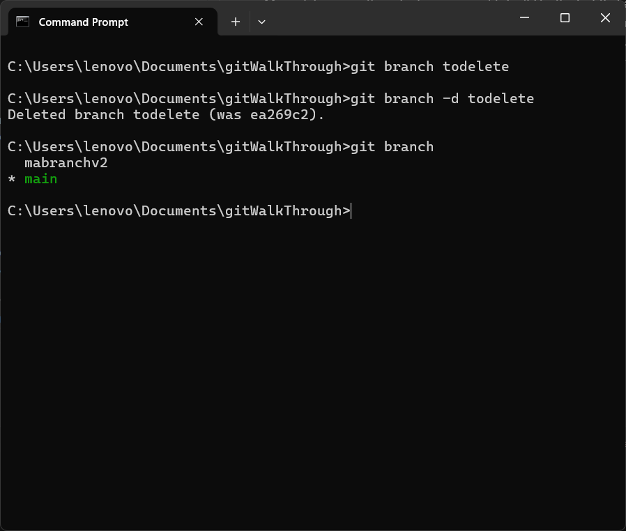

# Git Basic Walkthrough

In this tutorial we will get a tree in git, with several branches intergrating with each other for a project. The following diagram will be our tree visualized  

## 1. Installation of Git
**a. search on google for Git's website**  
You can just click on this [link](https://git-scm.com/)👈.  

  
 
 

**b. recon for Git's homepage**  
When locating the right web, this is what you will see in the first page.
  

 
 

**c. Download page for Git**
Choose your preference based on your local system OS.

 
 

**d. Installation for Git**  
Open the downloaded file from Git's web and follow the installation given, normally you just want to say yes to everything the installation recommends.

 
 

**e. Verify your installation**
Type on `git --version`, and the output will be like this👇.  

 
 

**f. Make yourself an account**  
Type on `git config --global user.name "your name"` to add your name. Then don't forget to type on `git config --global user.email "your email"` to add your email, remember always use ` " " `.

 
 

**🎉Congratulation, you've done it, you installed Git🎊**  
Next step we will start using git to a project.

 
 

## 2. Start Growing Our Tree🌳
**a. First step**
Start with creating a folder anywhere you want your project to be, or an existing project is fine. Though in this walk through we will use empty folder

 
 

**b. Set up**  
Open cmd in your folder, there are 2 ways, first right click on the empty folder and open cmd, or open cmd as usual but then you will need to do `cd` to your folder location.  

 

Then type on `git init` to initialize the Git system in your project folder.  

  
  

**c. Creation**  
Now, after being initialized, we can start placing items in our folder. In this tutorial we will place simple txt files only, but the system and logic applies to greater scaled projects.

  
  

**d. Adding**  
After having bunch of files aroun the folder, now we will add some files to the saving stage. By typing `git add` we will be able specifically move the file to the stage. In this walkthrough we will just add the `file1.txt` and `file2.txt` to the stage. Use `git add file1.txt` to just add that file, do the same for `file2.txt`.  

  
  

**e. Recon**  
We might lost track in the future about what files have we placed and what phase are we on, but don't worry too much. Git has a feature of `git status` to get information where you are right now and what has happened.  

  
  

**f. Commit**  
After adding them to the stage, saving in git is called as commit. `git commit -m "message"` will help you save and place a message, the message can be used to inform user what that save contain.  

  
  

**g. Logs**  
In the future, there might be big changes given to your project, and not always a good change. When that happen, we always can revert to our old phase as long as we remember to save our progress. We can use `git log` to check on which changes we want to revert first.

  
  

**h. Back in time**  
Alright, we have seen the log, just in case getting stuck on log, you can press `q` to exit. Back to seeing the log, we have seen the yellow text that looks like some hash codes, those codes will help us tell which save we want to revert to, in my example it's `a055cc2944975c43a481dbcc15d8310118b7832d`, now applying it to `git checkout` it will turn into `git checkout a055cc2944975c43a481dbcc15d8310118b7832d`, the output should look like this👇.  

  
  

**i. Check your branch**
Now the next useful feature in Git is branch. Branch is like having the same print of homework with your friend.
You might want to do the homework differently from your friend, but the task given is the same. Branching is having the same file at any point you would like, and not to disturb other's progress, you can instead just duplicate it and start your own modifications  

First, always check what you are on right now, specially when you are lost track of the job. For checking what you are on use `git branch`, this will tell you what branch are you working on.  

  
  

**f. Creating your branch**  
Alright, now simulate a situation where you want to modify or try something new but too afraid to interfere your main progress. `git branch mabranch` to create a branch with the name of "mabranch", modify the name to understand better.

 

**g. Modify the branch**  
Now we have made a branch, try to `ls`, then choose a file to edit, just write on the `.txt` file some random words, save it and don't forget to commit it.  

 

**h. Observe the branch**  
You will most likely on your master or main branch, now switch your branch into mabranch or whatever you chose previously using `git checkout mabranch`. You should be seeing difference in your branch, try using `type filename.txt`, this will show what's inside file.txt, things should be different than what you remember placing.

 
 

**i. Changes**  
Naming on a branch can change sometimes as we code. Features adding on that branch might give some new characteristic on it, so there is actually a way to change the name of a branch using the command of `git branch -m newName` on your current branch that needs new name and see directly the change by using `git branch`.  

 
 

**j. Combine**  
When there are some changes you like from other branch, you might feel like adding it to your current branch. The feature is available on git and it's `git merge`, this will merge a specific branch with your current branch. Commonly you will prefer to merge that other feaature to your main branch. First switch to your main branch first and then merge it with `git merge branchName`.  
 
Don't be shocked when you are seeing the vim editor on a flash like picture below.  
  
This is called vim, a text editor basically, you can type anything describing more about the merging. when done press `Esc` and type on `:wq` to write and quit from the vim editor. Now you will faced with another view such as the picture below.  
  
If you want that peace of mind knowing your merge really been recorded, you can go on check the logs, it will look something like this.  
  

 
 

**k. Remove**  
Meanwhile, on another situation, you might don't like the fact that another branch has a messed up modification and you would like to delete it, you can just simply type out `git branch -d branchName` and it will be gone. To save some readings, let's simulate creation of a branch and deleting it afterwards. You will get something like this.  

 
 

## 3. GitHub  
A social media, but more likeprogramming genre. Dont forget to create an account before starting.  

 
 

**a. Repository**  
After some coding, creating new things and finally you felt confident to upload your project and show it to the world, it's time for you to know about GitHub. First creat a repository on your GitHub, repository means folder. Fill out the name before hitting the green button circled in the image  

 
 

**b. Entering**  
The next thing you will see is your empty repository with a link like in the image below.  

 
 

**c. Origin**  
Now we need to add a remote repository to push or upload our code. The link from the previous point needs to be copied for `git remote add origin thelinkyoucopied.com`. The image below will most likely explains how.  

 
 

**d. Push**  
Next we have made clear our destination, now pushing it to the remote repository. Using `git push origin nameofbranch` to push certain branch to the remote repository.
